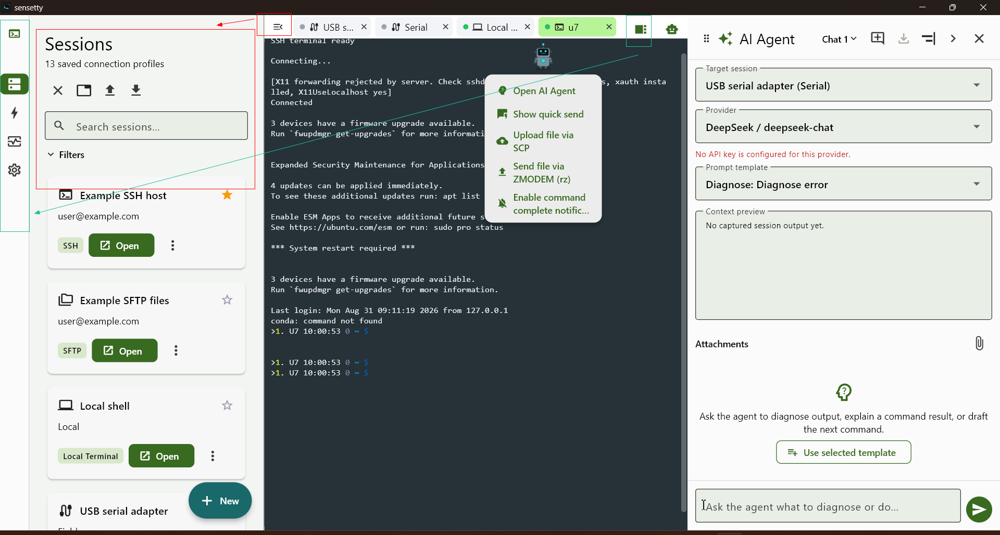
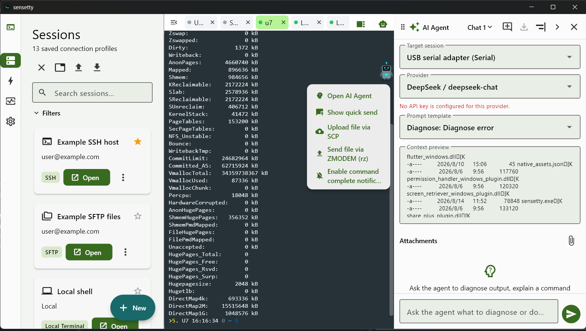
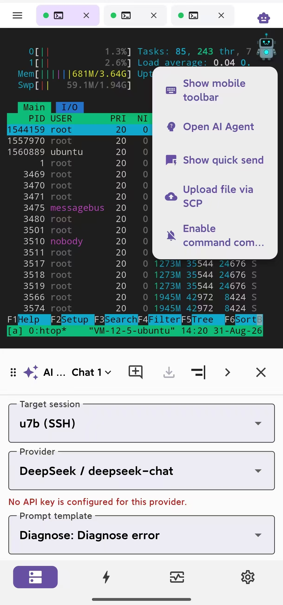
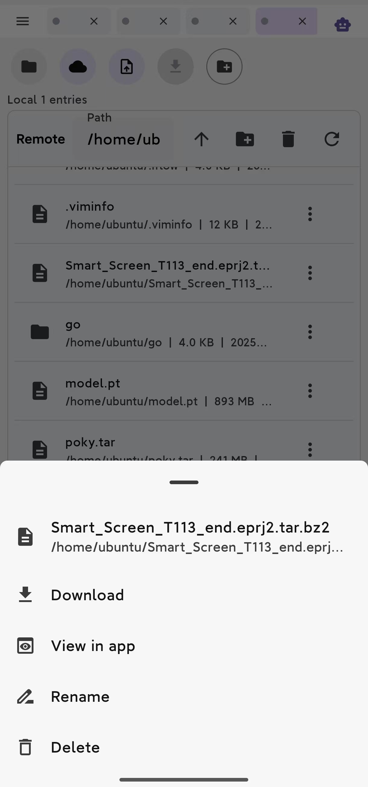
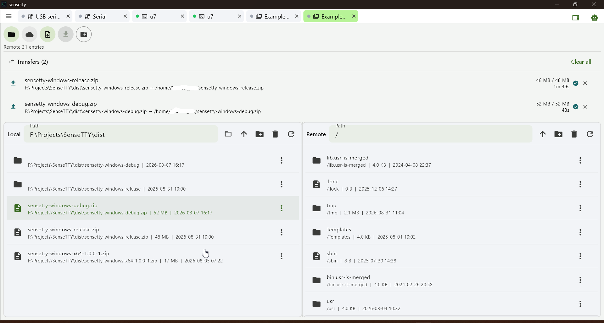
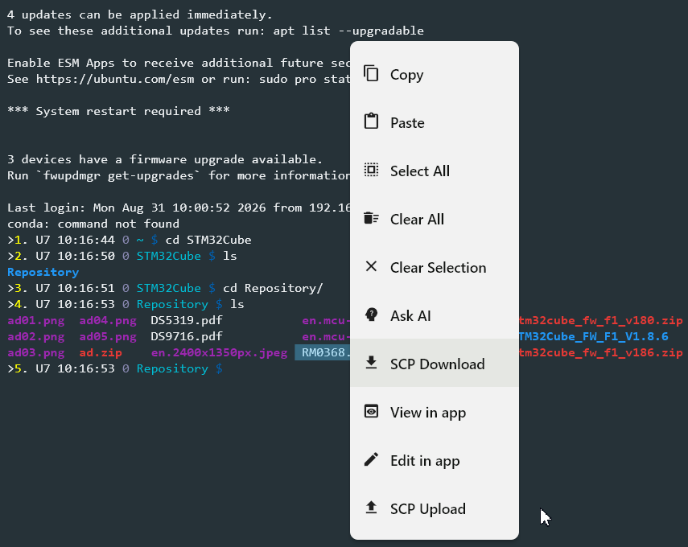
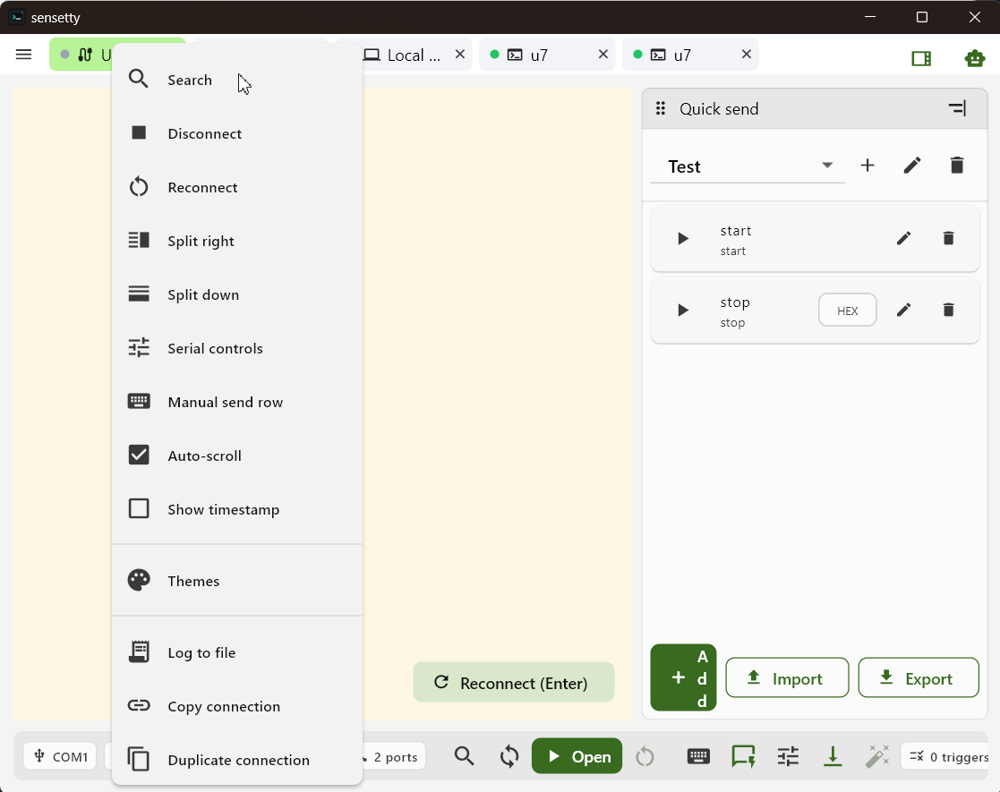
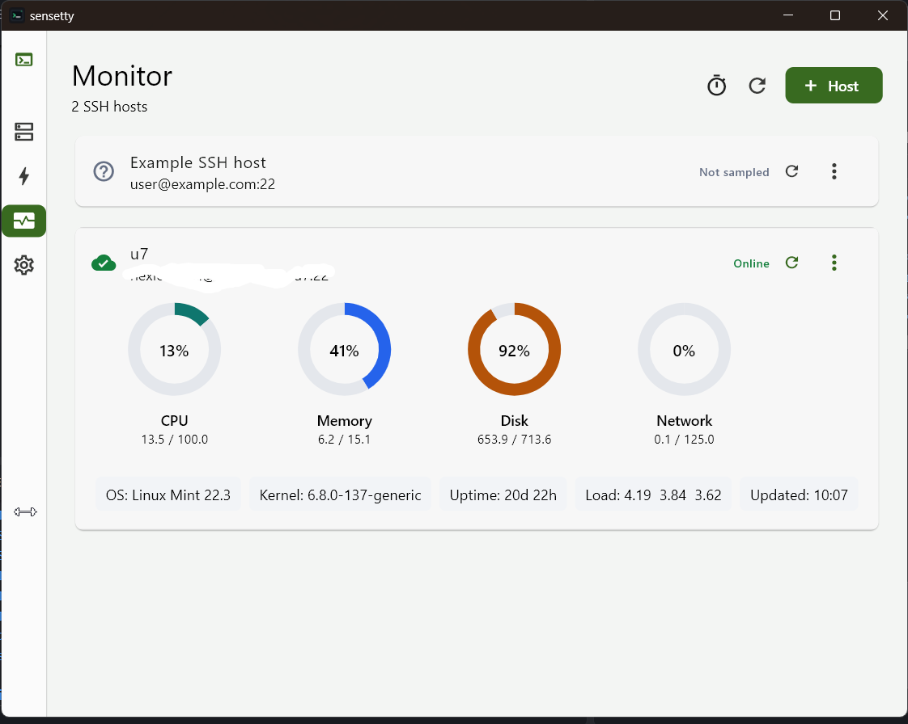
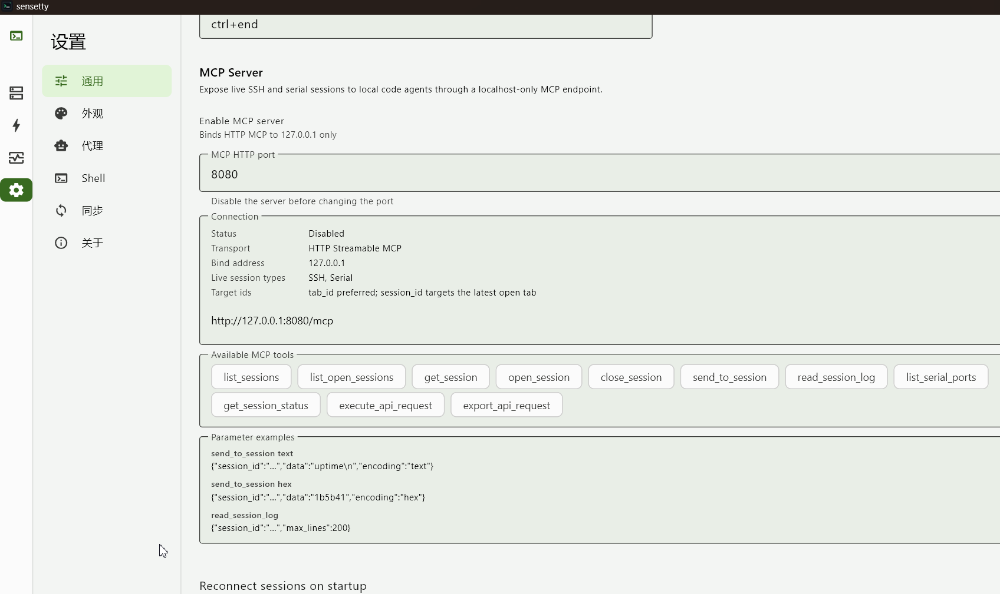

# SenseTTY 官方发布仓库

<div align="center">


**面向开发、运维与嵌入式工程师的现代化跨平台操作控制台与 AI 终端**

[]()
[]()
[]()

[English](README.md) | [简体中文](README_zh.md)



</div>

---

## 目录

- [概览](#概览)
- [下载与安装指南](#下载与安装指南)
  - [macOS 安装与 Gatekeeper 拦截说明](#macos-安装与-gatekeeper-拦截说明)
  - [Linux AppImage](#linux-appimage)
  - [Android APK](#android-apk)
  - [Windows 便携版](#windows-便携版)
- [核心特性](#核心特性)
  - [🖥️ 多协议终端与连接支持](#️-多协议终端与连接支持)
  - [🤖 智能 AI Agent 助手](#-智能-ai-agent-助手)
  - [📱 桌面与移动端无缝协同](#-桌面与移动端无缝协同)
  - [📁 双栏 SFTP 与文件传输](#-双栏-sftp-与文件传输)
  - [🔌 内置 MCP (Model Context Protocol) 服务](#-内置-mcp-model-context-protocol-服务)
  - [🎛️ 实时服务器健康监控](#️-实时服务器健康监控)
  - [⚙️ 会话管理与配置同步](#️-会话管理与配置同步)
- [界面展示](#界面展示)
- [快捷键指南](#快捷键指南)
- [问题反馈](#问题反馈)
- [开源协议](#开源协议)

---

## 概览

**SenseTTY** 是一款现代化跨平台运维与开发工作站。它将 **SSH 远程终端、SFTP 双栏文件管理、本地终端、硬件串口调试、Modbus 工业协议工具、AI 智能助手、MCP 协议服务** 以及 **服务器监控** 深度融合为一体。

无论是云端维护 Linux 集群，在嵌入式现场调试 **Serial / RS-485 / Modbus** 设备，还是通过 **AI Copilot** 进行智能日志诊断与指令生成，SenseTTY 都能提供极速、稳定且一致的跨平台操作体验。

---

## 下载与安装指南

您可以从 [GitHub Releases](https://github.com/tonyho/SenseTTY_release/releases) 下载最新编译好的安装包：

| 操作系统 | 架构类型 | 分发格式 | 下载链接 |
|:---------|:---------|:---------|:---------|
| **macOS** | **通用架构 (Universal Binary)**<br>(同时支持 Apple Silicon M1/M2/M3/M4 与 Intel x86_64) | `.zip` (App 包) | [下载 macOS 版本](https://github.com/tonyho/SenseTTY_release/releases/latest) |
| **Linux** | x86_64 | `.AppImage` | [下载 Linux AppImage](https://github.com/tonyho/SenseTTY_release/releases/latest) |
| **Android** | arm64-v8a, armeabi-v7a, x86_64 | `.apk` | [下载 Android APK](https://github.com/tonyho/SenseTTY_release/releases/latest) |
| **Windows** | x64 | `.zip` (免安装便携版) | [下载 Windows ZIP](https://github.com/tonyho/SenseTTY_release/releases/latest) |

---

### macOS 安装与 Gatekeeper 拦截说明

由于 macOS 版本暂未购买 Apple 开发者证书签名公证，系统 Gatekeeper 首次启动可能会提示 *“应用已损坏，打不开”* 或 *“无法验证开发者”*。

**解决方法**：
1. 解压 `sensetty-macos-*.zip`，将 `sensetty.app` 拖入 `/Applications`（应用程序目录）或保留在下载目录。
2. 打开系统**终端 (Terminal)**，执行以下命令移除安全隔离属性：
   ```bash
   # 如果已放入“应用程序”目录：
   xattr -cr /Applications/sensetty.app

   # 或者直接在“下载”目录中解除限制：
   xattr -cr ~/Downloads/sensetty.app
   ```
3. 执行后即可在访达 (Finder) 或启动台 (Launchpad) 直接双击打开 SenseTTY。

---

### Linux AppImage
1. 下载 `sensetty-linux-x64-*.AppImage`。
2. 赋予执行权限并直接运行：
   ```bash
   chmod +x sensetty-linux-x64-*.AppImage
   ./sensetty-linux-x64-*.AppImage
   ```

### Android APK
1. 在 Android 设备浏览器中下载 `sensetty-android-*.apk`。
2. 点击安装包直接安装（如系统提示请勾选“允许来自此来源的应用”）。

### Windows 便携版
1. 下载 `sensetty-windows-x64-*.zip`。
2. 解压压缩包，双击运行 `sensetty.exe`。

---

## 核心特性

### 🖥️ 多协议终端与连接支持
- **SSH 远程终端**：基于高性能 SSHv2 引擎，支持公私钥认证、Known Hosts 指纹信任机制、自动保持心跳（Keepalive）以及 256 色 / 真彩色（TrueColor）渲染。
- **本地终端 (Local Shell)**：直接访问系统内置命令行（Linux/macOS 的 Bash/Zsh、Windows 的 PowerShell/cmd.exe、Android 本地 Shell）。
- **串口通信 (UART/COM)**：支持波特率、数据位、校验位、停止位、流控配置，支持 Hex 十六进制收发与时间戳显示。
- **工业与网络协议**：内置 **Modbus TCP / RTU** 主机与从机调试工具，支持 TCP/UDP 原始 Socket 与 MQTT 消息交互。
- **分屏与多标签工作区**：支持水平与垂直分屏、标签页复制、会话独立浮动。

### 🤖 智能 AI Agent 助手
- **多模型支持**：无缝对接 **OpenAI (GPT-4o)**、**Anthropic Claude**、**DeepSeek-V3/R1**、**Ollama (本地大模型)** 及自定义兼容端点。
- **终端上下文感知**：一键捕获当前终端最近输出、错误日志或划选文本，自动带入 AI 诊断上下文。
- **可执行命令提取与一键运行**：AI 回复中的 Shell 命令自动提取为快捷按钮，点击即可直接写入并运行在当前会话中。
- **预设提示词模板**：内置故障诊断、命令解释、脚本生成、正则编写等多种高效 Prompt 模板。
- **移动端自适应布局**：桌面端左右分栏，移动端智能 Tab 分页（`对话` 与 `上下文/配置`），告别软键盘遮挡。

### 📱 桌面与移动端无缝协同
- **响应式界面架构**：桌面端宽屏多栏与分屏布局，移动端底部导航与抽屉式操作栏平滑过渡。
- **移动端虚拟快捷键栏**：针对触屏优化的 `Esc`、`Tab`、`Ctrl`、`Alt`、方向键及常用快捷操作。
- **平台专属特性过滤**：针对 Linux 桌面（窗口特性、系统托盘）与 Android 移动端（后台保活、通知渠道）分别优化。
- **全多语言支持 (i18n)**：深度支持中文与英文，设置中随时一键切换。

### 📁 双栏 SFTP 与文件传输
- **本地与远端双栏管理**：直观的目录树浏览、文件上传下载、重命名、权限修改与在线预览编辑。
- **终端内嵌 SCP 拖拽传输**：无需打开独立窗口，在 SSH 终端内直接拖拽文件即可触发快速传输。
- **后台高并发传输引擎**：大文件分块流式传输，支持传输进度可视化、断点重试与取消。

### 🔌 内置 MCP (Model Context Protocol) 服务
- **标准 AI 协议支持**：内置 Streamable HTTP MCP Server，使外部 AI 编码智能体（Claude Desktop、Cursor、Antigravity）能够安全地访问 SenseTTY 的终端状态、读取指标与执行核准命令。
- **MCP 检查器**：可视化查看 MCP Tools、Resources 和实时交互报文。

### 🎛️ 实时服务器健康监控
- **核心指标监测**：实时采集 CPU 负载、内存占用、磁盘空间、网络流量速率。
- **可视化动态图表**：集成 `fl_chart` 提供流畅的指标趋势折线图。
- **多服务器集群大盘**：在一个界面汇总多台主机状态，告警信息一目了然。

### ⚙️ 会话管理与配置同步
- **层级化会话树**：支持会话分组、色彩标签、图标标记与快捷搜索。
- **安全密钥存储**：密码与私钥通过系统安全 Keychain / 密钥环加密保存。
- **主题与外观自定义**：内置 Monokai、Solarized、Dracula、Nord、OneDark 等主题，支持字体与光标样式定制。

---

## 界面展示

### 桌面工作区


### 移动端体验
<div align="center">
<table>
  <tr>
    <td align="center"><b>移动端 SSH 终端与 AI 助手</b></td>
    <td align="center"><b>移动端 SFTP 文件管理</b></td>
  </tr>
  <tr>
    <td></td>
    <td></td>
  </tr>
</table>
</div>

### SFTP 与文件传输

*双栏 SFTP 文件管理，支持快速上传下载与文件在线预览。*


*在 SSH 会话内直接发起文件传输，极速便捷。*

### 串口终端与嵌入式调试

*硬件串口终端，支持波特率自适应、十六进制与字符流调试。*

### 服务器监控仪表盘

*实时服务器性能大盘，CPU、内存、磁盘与网络指标一网打尽。*

### MCP 服务与协议检查器

*内置 Model Context Protocol 服务与实时协议调用检查器。*

---

## 快捷键指南

### 全局快捷键
| 快捷键 | 功能 |
|:-------|:-----|
| `Ctrl + T` | 打开新建终端标签页 |
| `Ctrl + W` | 关闭当前活动标签页 |
| `Ctrl + Tab` | 切换到下一个标签页 |
| `Ctrl + Shift + Tab` | 切换到上一个标签页 |
| `Ctrl + Shift + F` | 切换工作区全屏模式 |
| `Ctrl + ,` | 打开设置中心 |

### 终端快捷键
| 快捷键 | 功能 |
|:-------|:-----|
| `Ctrl + Shift + C` / `Ctrl + C` | 复制选中终端文本 |
| `Ctrl + Shift + V` / `Ctrl + V` | 粘贴剪贴板内容 |
| `Ctrl + +` / `Ctrl + -` | 放大 / 缩小终端字体 |
| `Ctrl + 0` | 恢复终端默认字体大小 |
| `Ctrl + L` | 清屏并重置滚动回滚缓冲区 |

---

## 问题反馈

如果您在使用过程中遇到任何问题或有新功能建议，欢迎前往 [Issue 跟踪器](https://github.com/tonyho/SenseTTY_release/issues) 提交反馈。

---

## 开源协议

本项目采用 MIT 许可证开源 - 详见 [LICENSE](LICENSE) 文件。

---

<div align="center">

Made with ❤️ by the SenseTTY Team

</div>
